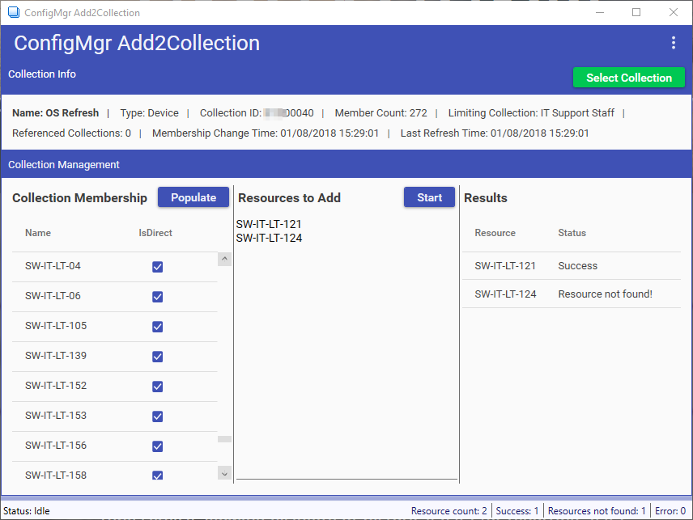
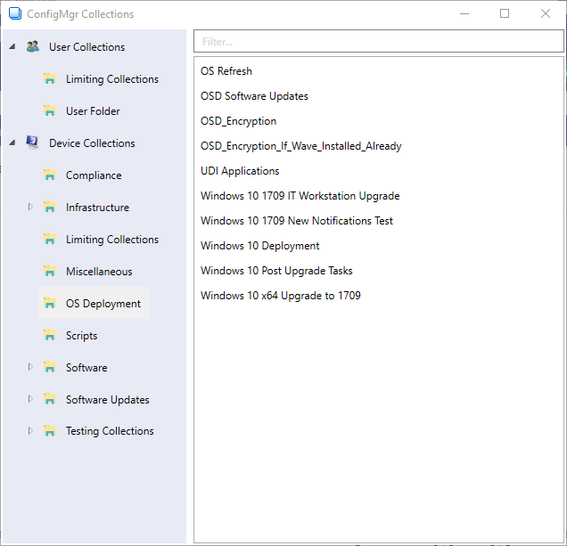

# ConfigMgr-Add2Collection
ConfigMgr Add2Collection is a free tool that allows IT administrators and support staff to add resources to collections in ConfigMgr independently of the ConfigMgr console. It honors role-based access control (RBAC) to limit visibility of collections where appropriate. It can be used either on the Site Server or a remote workstation using PS remoting.

The tool is coded in PowerShell using WPF for the UI.

## Screenshots

